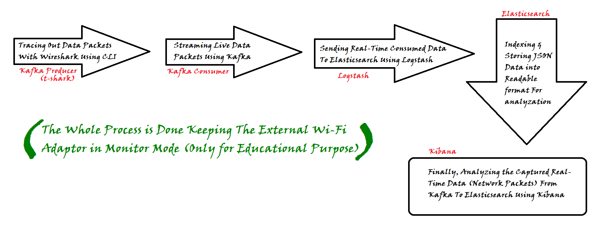

# Real Time Network Traffic Analysis For Threat Detection 

## 

## Process
As implemented and featured in Fig. 1, the process starts with capturing or tracing out the live data packets with “Tshark” (Wireshark CLI), a widely-used network protocol analyzer. It acts as a producer for “Kafka.” Kafka is very powerful for event streaming and maintaining logs. To view the live packets being streamed in Kafka, Kafka-consumer provides a very efficient CLI as well as API. Now, the packets as consumed in Kafka are sent to “Elasticsearch” where the JSON formatted data is indexed and stored into very easy and reliable format for performing different analyzations in “Kibana” via “Logstash”, which is yet another free and open source server-side data processing pipeline that ingests data from a multitude of sources (Kafka in our case), transforms it, and then sends it to your favorite "stash" (Elasticsearch in our case). Finally, exploring and analyzing of the data with stunning visualizations in Kibana makes the process complete and starts the job for the analysts.

## Flow Diagram

Fig. 1{align=center}

