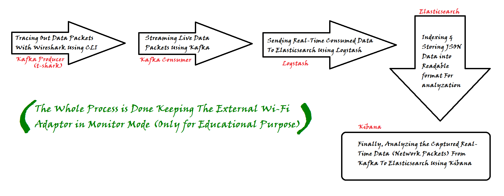

# Real Time Network Traffic Analysis For Threat Detection 

## Abstract
Wi-Fi is now ubiquitous in most populated areas, and the way the devices communicate leaves a lot of 'digital exhaust'. Usually, a computer will have a Wi-Fi device that’s configured to connect to a given network, but often these devices can be configured instead to pick up the background Wi-Fi chatter of surrounding devices. There can always be good reasons as well as bad ones for the same, but the matter is all about the intensions. So, now imagine how many packets are flowing in a network and how harmful or useful they can be. Keeping the bad part aside, we can use this for ethical purpose, like in this report. Now, the analysis can be done by examining the flow of packets (which can add some reasonable meaning to it) that are being sent/received over the network (heavily). This report basically revolves around the analysis and hence, can be detected on a real-time basis.

**Keywords:** Wireshark CLI (tshark), Zookeeper, Kafka, Logstash, Elasticsearch, Kibana.

## Process
As implemented and featured in Flow Diagram (Fig. 1) below, the process starts with capturing or tracing out the live data packets with “Tshark” (Wireshark CLI), a widely-used network protocol analyzer. It acts as a producer for “Kafka.” Kafka is very powerful for event streaming and maintaining logs. To view the live packets being streamed in Kafka, Kafka-consumer provides a very efficient CLI as well as API. Now, the packets as consumed in Kafka are sent to “Elasticsearch” where the JSON formatted data is indexed and stored into very easy and reliable format for performing different analyzations in “Kibana” via “Logstash”, which is yet another free and open source server-side data processing pipeline that ingests data from a multitude of sources (Kafka in our case), transforms it, and then sends it to your favorite "stash" (Elasticsearch in our case). Finally, exploring and analyzing of the data with stunning visualizations in Kibana makes the process complete and starts the job for the analysts.

## Flow Diagram

Fig. 1

